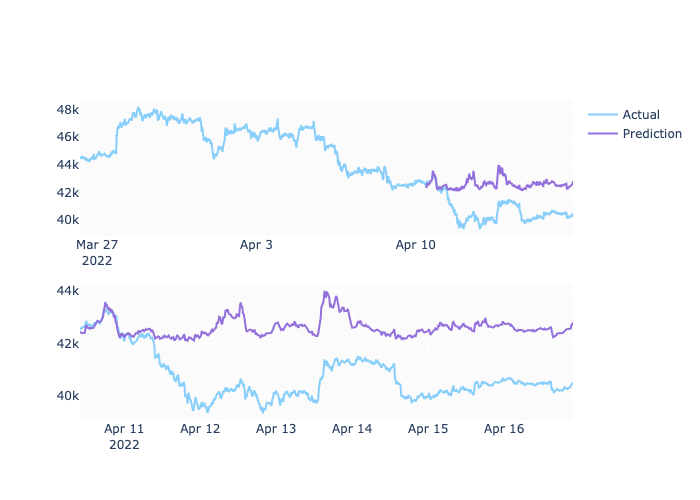

# XGBoost Crypto Predictor
---

This Jupyter Notebook uses XGBoost regression to predict different crypto coin prices based on historical data. The predictions are based on different trading indicators and processed through the algorithm with varying timeframes and durations.
  

---
### Technologies
Python 
Pandas 
Jupyter Lab 
Tradingview 
XGBoost 
SciKitLearn 

---
### Contributors
Rachel Bates 

---
### License
MIT 

